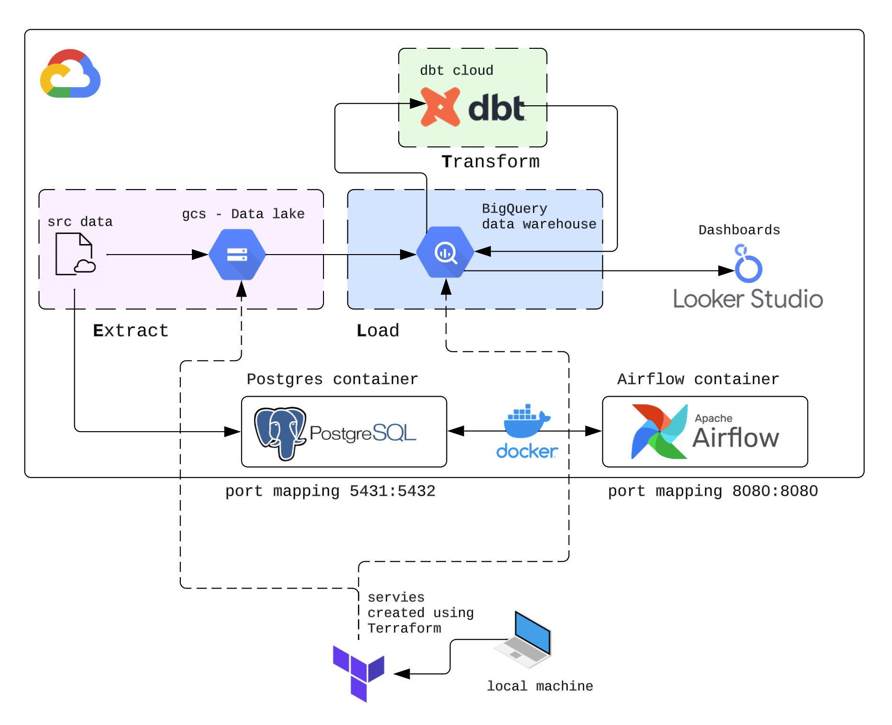
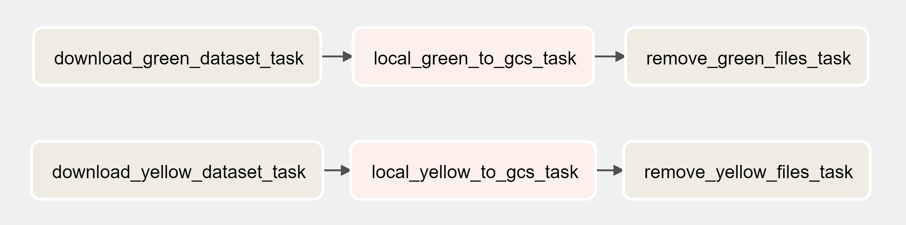
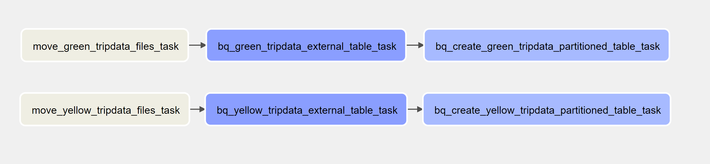
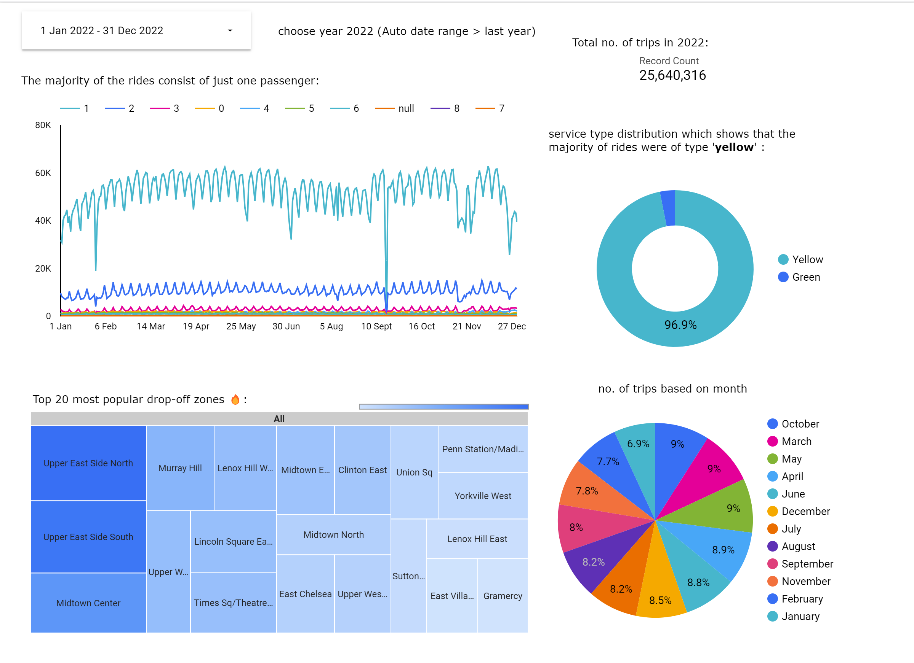

# NYC Taxi Data Analytics

Analyzing NYC Yellow and Green Taxi Trip Records to identify key trends, routes, and patterns, and utilizing ELT (Extract, Load, Transform) processes to extract meaningful insights. Furthermore, Looker Studio has been used to craft interactive dashboards for comprehensive visualization and analysis.

**NOTE:** files from DBT cloud are stored in this repo : https://github.com/LaeekAhmed/dtc-de-analytics 

## Source Data

Data source - yellow and green taxi trip records: https://www.nyc.gov/site/tlc/about/tlc-trip-record-data.page

Yellow trips schema : https://www.nyc.gov/assets/tlc/downloads/pdf/data_dictionary_trip_records_yellow.pdf

Green trips schema : https://www.nyc.gov/assets/tlc/downloads/pdf/data_dictionary_trip_records_green.pdf

---
## Infrastructure

Architecture Diagram (ELT pipeline) :

Data from the source website is extracted and stored in gcs, data is then loaded into BigQuery by creating external and partitioned tables. DBT then fetches data from these tables, applies transformations and loads it back into BigQuery. Looker studio is then used to create dashboards based on the records in these tables. 

- Used **Terraform** to set up the infrastructure 
- Used a docker containers to run everything.
- Used **Airflow** to orchestrate the entire pipeline
- Used **gcs** as data lake and **BigQuery** as data warehouse
- Used **Postgres** as a testing/development database
- Used **DBT cloud** to process, transform and clean the data

Airflow Dags :

[src_to_gcs_dag.py](Airflow/dags/src_to_gcs_dag.py)
downloads data from the source website, uploads it to gcs and then removes it from the local folder.

[gcs_to_bq_dag.py](airflow/dags/gcs_to_bq_dag.py) is used to re-arrange the files within gcs, create an external table based on these files and then create a partitioned table from the external table.

Lastly, there is the [src_to_postgres_dag.py](airflow/dags/src_to_postgres_dag.py) to load data from the web source into the Postgres database.

files from DBT cloud are stored in this repo : https://github.com/LaeekAhmed/dtc-de-analytics 

## Dashboard

[looker studio dashboard ↗](https://lookerstudio.google.com/reporting/d17f4dca-42d1-4db0-b5f1-3aed43654d45)

